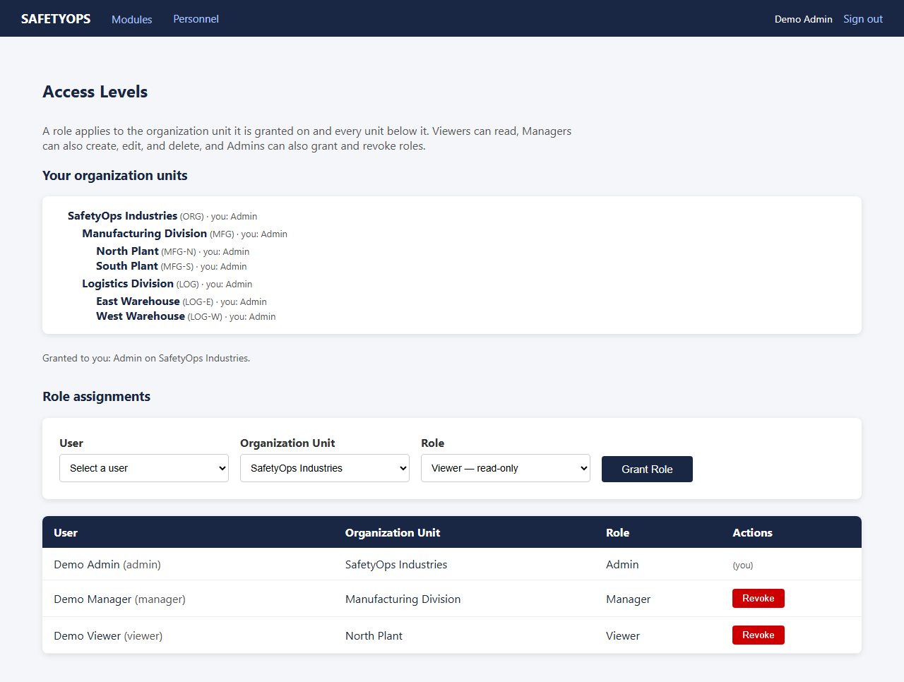
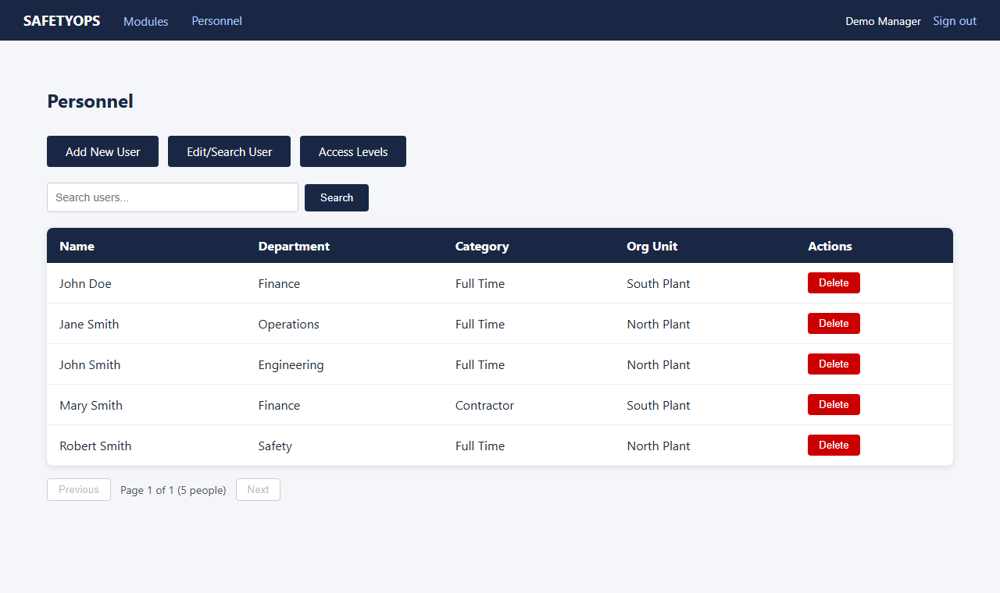
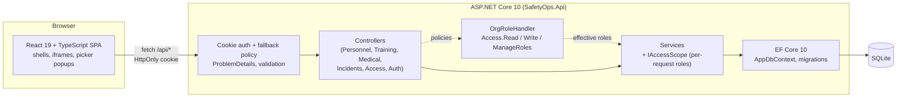
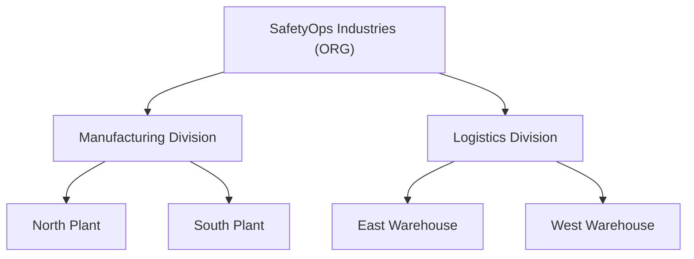

# SafetyOps

[](https://github.com/jamesmyers4/SafetyOpsApp/actions/workflows/ci.yml)
[](LICENSE)

SafetyOps is a workplace-safety records system built as a C# backend showcase: an ASP.NET Core 10 Web API over EF Core and SQLite, with cookie authentication and **role-based access control across an organization hierarchy**, fronted by a React + TypeScript SPA. It tracks personnel, training classes, medical surveillance appointments, and incident reports. Every record belongs to a unit in an org tree, and what you can see or change is decided per unit by your role there. The API is covered by 171 NUnit tests, most of them integration tests against a real (in-memory) database.



## What this demonstrates

- **Layered API design.** Thin controllers → services behind interfaces → EF Core. Request/response records keep entities off the wire (no overposting). Services return a `Result<T>`/`ServiceError` that controllers map to HTTP, instead of throwing for expected failures.
- **REST and error handling.** 201 + `Location`, 204, paged list envelopes, and RFC 9457 problem details everywhere: `ValidationProblemDetails` keyed by JSON property name, 404/403/409 as `ProblemDetails`. Unknown `/api` routes get a 404, not the SPA.
- **EF Core done carefully.** Fluent configurations, migrations committed, reference data in `HasData`, `DateOnly` columns, owned collections, `AsNoTracking` reads that project straight to DTOs, escaped `LIKE` search, and FK rules that turn "delete a person with history" into a 409.
- **Authentication.** Cookie auth tuned for an API (HttpOnly, Secure, SameSite=Lax, 401/403 instead of redirects), `PasswordHasher` hashes, the same hashing work for unknown users as for wrong passwords (so timing doesn't reveal valid user names), and a fallback policy so every endpoint is closed unless marked anonymous.
- **Hierarchical RBAC.** Viewer, Manager, and Admin roles are granted per org unit and inherited by every unit below it. A custom `IAuthorizationHandler` backs the endpoint policies, and a request-scoped `IAccessScope` filters queries and checks each record's unit. Records outside your scope are 404 and read-only records are 403. Permissions are read per request, so a revoke takes effect on the next call.
- **Testing.** `WebApplicationFactory<Program>` with a fresh, migrated SQLite in-memory database per test and a `FakeTimeProvider` clock. The suite covers every endpoint's happy path, validation, 404/409, 401 for every route, and a role × action × scope matrix across sites, divisions, siblings, and parents. Fixtures run in parallel.
- **Engineering hygiene.** `TreatWarningsAsErrors` with `latest-recommended` analyzers, nullable reference types, `dotnet format` in CI, strict TypeScript, Dependabot, a multi-stage non-root Docker image, and a CI job for each of API, web, and Docker.

The UI is deliberately awkward to automate (iframe shells with a parent-level Save button, popup picker windows, and origin-checked `postMessage` handoffs) because the app is also the system under test for the companion end-to-end suite, [SafetyOpsTests-Playwright](https://github.com/jamesmyers4/SafetyOpsTests-Playwright) (C#, NUnit, Playwright).

## Run it in 60 seconds

With Docker:

```bash
docker compose up --build
```

Open <http://localhost:8080> and sign in with a demo account:

| User | Password | Role | Sees |
| ---- | -------- | ---- | ---- |
| `admin` | `admin` | Admin on the whole organization | Everything; can grant and revoke roles |
| `manager` | `manager` | Manager on Manufacturing Division | Manufacturing, North Plant, and South Plant records; can create, edit, delete |
| `viewer` | `viewer` | Viewer on North Plant | North Plant records, read-only |

Sign in as `manager` and `viewer` to see the same pages scoped differently:



The SQLite database lives on the `safetyops-data` volume; `docker compose down -v` resets it to fresh demo data.

## Develop locally

Prerequisites: .NET 10 SDK and Node.js 20+.

```bash
cd safetyops-web && npm install && cd ..
dotnet run --project SafetyOps.Api --launch-profile https
```

This starts the API on <https://localhost:7121>, and the ASP.NET Core SPA proxy starts the Vite dev server on <https://localhost:14418>. Open that URL; Vite proxies `/api` to the API. In Visual Studio, open `SafetyOps.slnx` and run `SafetyOps.Api`.

In Development the database is created and migrated on first run (`SafetyOps.Api/App_Data/safetyops.db`), and the demo accounts and demo data are seeded. The accounts come from `Auth:DemoUsers` in `appsettings.Development.json`; other environments supply them through configuration (environment variables or user secrets). API docs: <https://localhost:7121/scalar> (OpenAPI at `/openapi/v1.json`).

```bash
dotnet test SafetyOps.slnx                   # 171 API tests
dotnet format SafetyOps.slnx --verify-no-changes
cd safetyops-web && npm run lint && npm run build
```

## Architecture





A role granted on a unit covers that unit and everything below it: `manager` (Manager on Manufacturing) can change North and South Plant records but can't see Logistics or anything at the organization level.

## Project structure

```text
SafetyOps.slnx
SafetyOps.Api/
  Domain/                  Entities: Person, TrainingClass, Course, MedicalAppointment,
                           Stressor, WorkTask, Incident, OrgUnit, RoleAssignment, AppUser
  Data/                    AppDbContext, Fluent configurations, migrations, demo-data seeder
  Features/
    Access/                IAccessScope, OrgRoleHandler + policies, role assignment API
    Auth/                  Cookie sign-in, password hashing, demo account seeding
    Common/                Result/ServiceError, paging, problem-details mapping
    Personnel/ Training/ MedicalSurveillance/ Incidents/
                           Contracts (DTOs) + service + controller per module
  Program.cs
tests/SafetyOps.Api.Tests/
  Infrastructure/          WebApplicationFactory with per-test SQLite and a fake clock
  Features/                Integration tests per module, auth, and the RBAC matrix
  Unit/                    Access inheritance, services, helpers
safetyops-web/             React + TypeScript SPA (Vite)
  src/services/api.ts      Typed API client (problem details, ISO date conversion)
  src/auth/                Route guard and the session/permissions context
  src/components/ pages/   Shared components; pages per module
Dockerfile, docker-compose.yml
```

## API

Every endpoint except sign-in requires the auth cookie and returns `401` (never a redirect) without it. Module endpoints also need a role: reads need Viewer somewhere, and writes need Manager on the record's unit. Resource lists are paged (`?search=&page=1&pageSize=25`, max 100) and return `{ items, page, pageSize, totalCount, totalPages }`. Dates are ISO 8601.

| Method | Route | Success |
| ------ | ----- | ------- |
| POST | `/api/auth/login` | 200 user + access summary, sets the cookie (anonymous) |
| GET | `/api/auth/me` | 200 current user + access summary |
| POST | `/api/auth/logout` | 204 |
| GET | `/api/personnel` | 200 paged |
| POST | `/api/personnel` | 201 + `Location` |
| GET / PUT | `/api/personnel/{id}` | 200 |
| DELETE | `/api/personnel/{id}` | 204 (409 if the person has appointments or incidents) |
| GET | `/api/personnel/lookup` | 200 id/name options |
| GET | `/api/training/classes` | 200 paged |
| POST | `/api/training/classes` | 201 + `Location` |
| GET / PUT | `/api/training/classes/{id}` | 200 |
| DELETE | `/api/training/classes/{id}` | 204 |
| GET | `/api/training/courses` | 200 |
| GET | `/api/medical-surveillance/appointments` | 200 paged |
| POST | `/api/medical-surveillance/appointments` | 201 + `Location` |
| GET / PUT | `/api/medical-surveillance/appointments/{id}` | 200 |
| DELETE | `/api/medical-surveillance/appointments/{id}` | 204 |
| GET | `/api/medical-surveillance/persons` | 200 |
| GET | `/api/medical-surveillance/work-tasks` | 200 |
| GET | `/api/incidents` | 200 paged (`?status=&category=` filters) |
| POST | `/api/incidents` | 201 + `Location` |
| GET / PUT | `/api/incidents/{id}` | 200 |
| DELETE | `/api/incidents/{id}` | 204 |
| GET | `/api/access/org-units` | 200 units you can see, with your role |
| GET / POST | `/api/access/assignments` | 200 / 201 (Admin on the unit) |
| DELETE | `/api/access/assignments/{id}` | 204 (Admin; not your own) |
| GET | `/api/access/users` | 200 (Admin) |
| GET | `/healthz` | 200 |

## License

[MIT](LICENSE)
